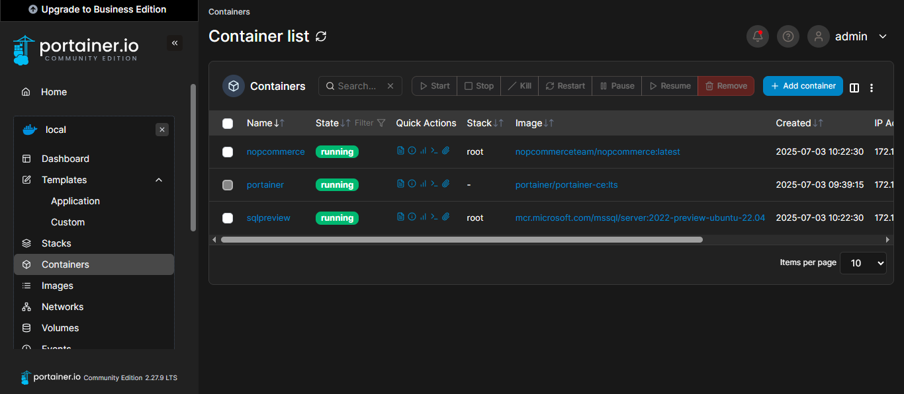

# 🚀 Deploying nopCommerce with Docker Compose on Linux  
**By Z | July 3, 2025**

---

## 1. Introduction: Why Containerize nopCommerce?

Deploying nopCommerce with Docker Compose brings reliability, portability, and streamlined workflows. But without careful setup, common issues like data loss and container management can undermine the benefits. This blog walks through:

- Initial setup with Docker Compose  
- Troubleshooting data persistence issues  
- Adding Portainer UI for container management  
- End-to-end validation and best practices

---

## 2. Overview of the Deployment Architecture

Your architecture includes:

1. **nopCommerce app container** – serves the .NET storefront  
2. **SQL Server container** – the backend database  
3. **Portainer container** – web-based Docker manager on Linux  
4. **Docker volumes** – persistent storage for both app and DB  
5. **Docker network** – seamless communication among containers  
6. **Docker Compose** – orchestrating and managing services

---

## 3. Step-by-Step Guide

### ✅ 3.1 Step 1 – Create Basic `docker-compose.yml`

```yaml
version: '3.4'

services:
  db:
    image: mcr.microsoft.com/mssql/server:2019-latest
    environment:
      SA_PASSWORD: "YourStrong!Passw0rd"
      ACCEPT_EULA: "Y"
    ports:
      - "1433:1433"

  nopcommerce:
    image: nopcommerceteam/nopcommerce:latest
    depends_on:
      - db
    ports:
      - "8080:80"
```

```bash
docker-compose up
```

  
*Initial Installation Screen: Configure store and database*

---

### ⚠️ 3.2 Problem – Data Disappears on Restart

After adding test users, I restarted the containers:

```bash
docker-compose down
docker-compose up
```

❌ **Issue**: nopCommerce showed the installation page again. All data lost.

---

### 🔍 3.3 Root Cause – No Volume = No Persistence

By default, containers don't retain changes unless volumes are used. To ensure data persistence, we must bind critical directories using named Docker volumes.

---

### 💾 3.4 Step 3 – Add Docker Volumes for Persistence

Update Compose:

```yaml
services:
  db:
    volumes:
      - db_data:/var/opt/mssql

  nopcommerce:
    volumes:
      - nop_data:/app/App_Data

volumes:
  db_data:
  nop_data:
```

Run:

```bash
docker-compose down -v
docker-compose up -d
```

  
*Docker Volumes: Showing persisted data volumes*

---

### 🔁 3.5 Step 4 – Validate Persistence

```bash
docker-compose down && docker-compose up -d
```

Check admin panel to confirm your data persisted:

  
*Admin Panel: nopCommerce dashboard with saved product data*

  
*SQL Logs: Database service starting and loading nopCommerce DB*

---

## 4. Add Portainer UI for Docker Management

Since Docker Desktop doesn't work on Linux, Portainer fills that gap.

Add to your `docker-compose.yml`:

```yaml
  portainer:
    image: portainer/portainer-ce
    container_name: portainer
    restart: always
    ports:
      - "9000:9000"
    volumes:
      - /var/run/docker.sock:/var/run/docker.sock
      - portainer_data:/data

volumes:
  db_data:
  nop_data:
  portainer_data:
```

Run:

```bash
docker-compose up -d
```

Visit: `http://localhost:9000` to finish Portainer setup.

  
*Portainer Dashboard: Showing running containers*

---

## 5. Frontend Store Test

Visit `http://localhost:8080` and verify the storefront loads:

  
*Frontend Store UI: nopCommerce storefront running on Docker*

---

## 6. Summary of Docker Workflow

| Task                          | Command                           |
|-------------------------------|------------------------------------|
| Start services                | `docker-compose up -d`            |
| Stop services                 | `docker-compose down`             |
| Wipe containers + volumes     | `docker-compose down -v`          |
| Explore volumes               | `docker volume ls`                |
| Access Portainer              | `http://localhost:9000`           |
| Access nopCommerce storefront | `http://localhost:8080`           |

---

## 7. Troubleshooting Tips

| Issue                        | Fix                                  |
|-----------------------------|---------------------------------------|
| Data lost after restart     | Use Docker volumes                    |
| Installation screen repeats | Persist `/app/App_Data`              |
| SQL fails to connect        | Check port 1433 and password strength |
| App can't reach DB          | Delay start or add health check       |
| No UI on Linux              | Use Portainer instead of Docker Desktop |

---

## 8. Best Practices & Next Steps

- Use `.env` file to manage secrets and configs  
- Automate backups for Docker volumes  
- Add health checks for DB and app readiness  
- Extend this setup for production or CI/CD workflows

---

## 9. Conclusion

With Docker Compose, named volumes, and Portainer UI, you now have a stable nopCommerce development environment on Linux. It’s persistent, visual, and entirely platform-independent.

Happy containerizing! 🐳🛍️

---

