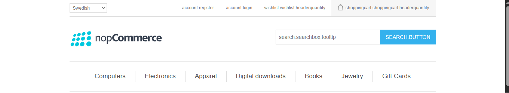
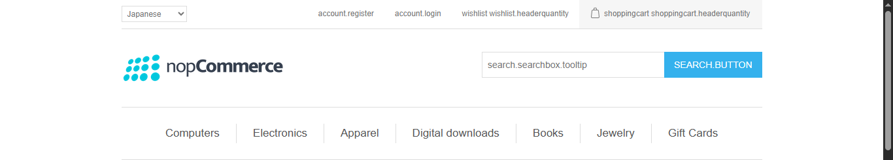

# Setting Up nopCommerce on IIS with Multi-Store, SSL, and Domain Configuration

## Introduction

In this blog post, we will walk through setting up nopCommerce from the official GitHub repository and hosting it on IIS. We will also cover how to configure multiple stores, enable SSL using self-signed certificates, and access each store with its own domain, language, and currency.

This guide is perfect for developers or businesses looking to simulate a multi-tenant nopCommerce setup in a local environment before deploying to production.

---

## 1. Cloning nopCommerce from GitHub

1. Visit the official GitHub repo: [https://github.com/nopSolutions/nopCommerce](https://github.com/nopSolutions/nopCommerce)
2. Clone the repo:

   ```bash
   git clone https://github.com/nopSolutions/nopCommerce.git
   ```
3. Open the solution in Visual Studio.
4. Build the solution.

---

## 2. Setting up nopCommerce on IIS

> 💡 **Troubleshooting Tip:** If you encounter an `HTTP Error 500.19` at this point, it's likely due to missing IIS modules or configuration issues. Make sure the **IIS URL Rewrite Module** is installed and that required **Windows features** (such as ASP.NET and .NET Extensibility) are enabled. Restart your server after enabling them.

1. Open IIS Manager.
2. Add a new site:

   * Site name: `nopcom`
   * Physical path: `<path-to-nopCommerce>/Presentation/Nop.Web`
   * Port: 80
   * Hostname: `nopcom.local`
3. Create a new Application Pool targeting .NET CLR v6 or latest.
4. Assign the app pool to the site.

---

## 3. Editing Hosts File

Edit `C:\Windows\System32\drivers\etc\hosts` and add:

```
127.0.0.1 nopcom.local
```

---

## 4. Creating and Binding a Self-Signed SSL Certificate

> ⚠️ **Common Issue:** Sometimes self-signed certificates are not recognized as trusted by the browser or system. To fix this:
>
> * Use PowerShell to create the cert.
> * Import the certificate into the **Trusted Root Certification Authorities** store.
> * When binding the certificate in IIS, ensure **SNI** is enabled for each domain.

1. Use PowerShell to create a cert:

   ```powershell
   New-SelfSignedCertificate -DnsName "nopcom.local" -CertStoreLocation "cert:\LocalMachine\My"
   ```
2. In IIS:

   * Bind a new HTTPS binding to `nopcom.local`
   * Assign the self-signed certificate
   * Enable SNI

---

## 5. Running nopCommerce Installation Wizard

1. Navigate to `https://nopcom.local`
2. Fill out DB and admin details.
3. Complete the installation.
4. Access Admin Login


---

## 6. Creating Multiple Stores

> ⚠️ **Note:** After creating stores, assigning SSL URLs may fail if SSL bindings for the domains are not properly configured in IIS. Double-check your bindings, ensure certificates exist for each store domain, and that each domain is mapped correctly in the `hosts` file.

1. In Admin → Configuration → Stores
2. Add three stores:

   * `nopcom1.local` (Japan)
   * `nopcom2.local` (Sweden)
   * `nopcom3.local` (Canada)
3. Each store should have a unique URL.





> ⚠️ **Note:** After creating stores, assigning SSL URLs may fail if SSL bindings for the domains are not properly configured in IIS. Double-check your bindings, ensure certificates exist for each store domain, and that each domain is mapped correctly in the `hosts` file.

1. In Admin → Configuration → Stores

2. Add three stores:

3. In Admin → Configuration → Stores

4. Add three stores:

   * `nopcom1.local`
   * `nopcom2.local`
   * `nopcom3.local`

5. Each store should have a unique URL.

Update hosts file:

```
127.0.0.1 nopcom1.local
127.0.0.1 nopcom2.local
127.0.0.1 nopcom3.local
```

---

## 7. Configuring Multi-Language and Multi-Currency

> 🧠 **Tip:** If store-specific language or currency settings don't appear correctly, it's often due to improper store URL configuration or untrusted SSL. Clear your browser cache and ensure each domain is accessible over HTTPS before assigning it in admin.

1. Admin → Configuration → Language → Add three languages (e.g., English, French, Hindi)
2. Admin → Configuration → Currency → Add USD, EUR, INR
3. Optionally assign specific languages and currencies per store.


> 🧠 **Tip:** If store-specific language or currency settings don't appear correctly, it's often due to improper store URL configuration or untrusted SSL. Clear your browser cache and ensure each domain is accessible over HTTPS before assigning it in admin.

1. Admin → Configuration → Language → Add three languages (e.g., English, French, Hindi)

2. Admin → Configuration → Language → Add three languages (e.g., English, French, Hindi)

3. Admin → Configuration → Currency → Add USD, EUR, INR

4. Optionally assign specific languages and currencies per store.

---

## 8. Enabling SSL in nopCommerce

1. Admin → Configuration → Stores
2. Edit each store and enable the SSL checkbox

---

## 9. Creating More Self-Signed SSL Certificates

Repeat for each domain:

```powershell
New-SelfSignedCertificate -DnsName "nopcom1.local" -CertStoreLocation "cert:\LocalMachine\My"
New-SelfSignedCertificate -DnsName "nopcom2.local" -CertStoreLocation "cert:\LocalMachine\My"
New-SelfSignedCertificate -DnsName "nopcom3.local" -CertStoreLocation "cert:\LocalMachine\My"
```

Assign each certificate in IIS bindings using SNI.

---

## 10. Testing the Setup

* Visit:

  * `https://nopcom1.local`
  * `https://nopcom2.local`
  * `https://nopcom3.local`
* Ensure:

  * HTTPS is active
  * SSL is enabled in admin panel
  * Correct store loads
  * Language and currency options appear correctly


* Visit:

  * `https://nopcom1.local`
  * `https://nopcom2.local`
  * `https://nopcom3.local`
* Ensure:

  * HTTPS is active
  * SSL is enabled in admin panel
  * Correct store loads
  * Language and currency options appear correctly

---

## 11. Troubleshooting & Errors Faced

Even in a well-documented platform like nopCommerce, local IIS deployment can throw some curveballs. Here are the real-world errors I faced — and how I tackled them.

### ⚠️ Error 500.19 - Internal Server Error

* **Symptoms:** The application failed to load on IIS, throwing a 500.19 configuration error.
* **Cause:** Missing IIS modules like URL Rewrite or missing Windows features.
* **Fix:**

  * Installed **IIS URL Rewrite Module**.
  * Verified `.NET Core Hosting Bundle` was installed.
  * Enabled required Windows features (via Windows Features UI).
  * Rebooted the machine after installation.

### 🔒 Self-Signed SSL Not Working Over HTTPS

* **Symptoms:** After generating self-signed certificates, browsers would block access or show the site as insecure.
* **Cause:**

  * Certificate not trusted by the system.
  * Certificate bound incorrectly in IIS.
  * SNI not enabled.
* **Fix:**

  * Regenerated certificates with PowerShell.
  * Ensured each domain's certificate was installed in the **Trusted Root Certification Authorities**.
  * Enabled **SNI** when binding the cert to the domain in IIS.

### 🌐 Could Not Assign SSL URLs to Stores

* **Symptoms:** After creating stores in nopCommerce Admin, assigning their respective SSL URLs failed.
* **Cause:**

  * SSL bindings were not properly configured in IIS for each domain.
  * Missing or untrusted certificates.
* **Fix:**

  * Verified each domain was mapped in the `hosts` file.
  * Created individual self-signed certs for each domain.
  * Properly bound each cert to the store domain using SNI.

### 🧩 Multi-Store Admin Not Reflecting URLs

* **Symptoms:** Store-specific settings (language, currency) weren’t displaying correctly.
* **Cause:**

  * Store URLs weren’t fully registered or weren’t accessible due to HTTPS issues.
* **Fix:**

  * Revisited Admin → Configuration → Stores.
  * Re-mapped each store to its domain and verified bindings.
  * Cleared browser cache and restarted IIS.

---

## Conclusion

With this setup, you’ve successfully configured nopCommerce with multiple stores on a local IIS server, each with its own domain, self-signed SSL certificate, languages, and currencies. This mirrors a real-world enterprise eCommerce solution in a local test environment.

In a production environment, replace self-signed certificates with valid ones and configure DNS records accordingly. This setup taught me how crucial proper IIS configuration, certificates, and binding are — and how to troubleshoot them effectively.
